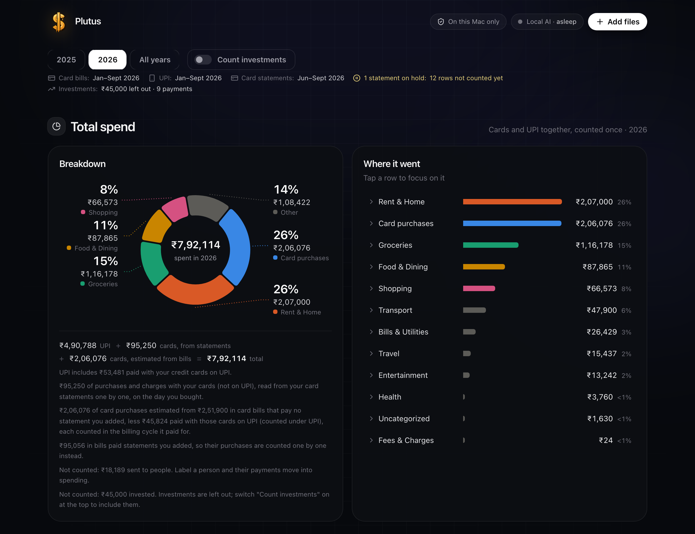
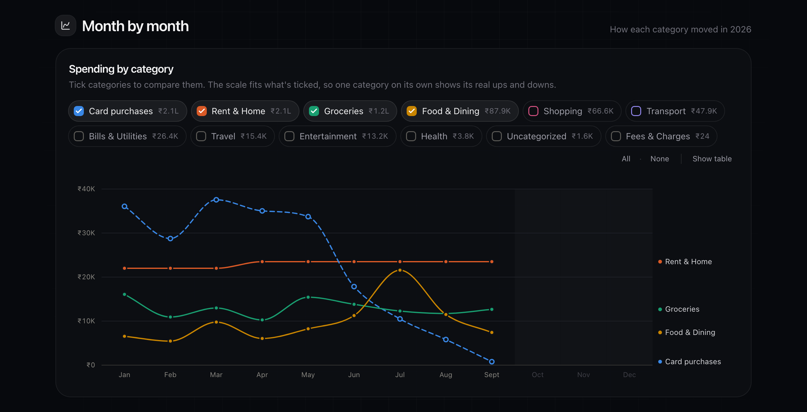
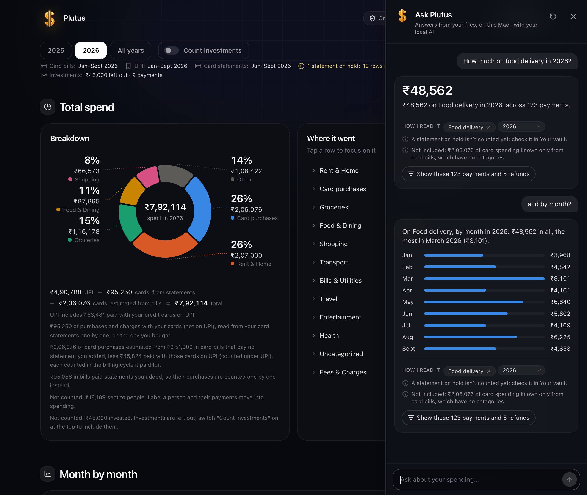
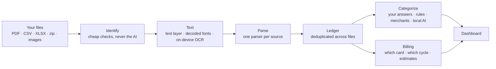
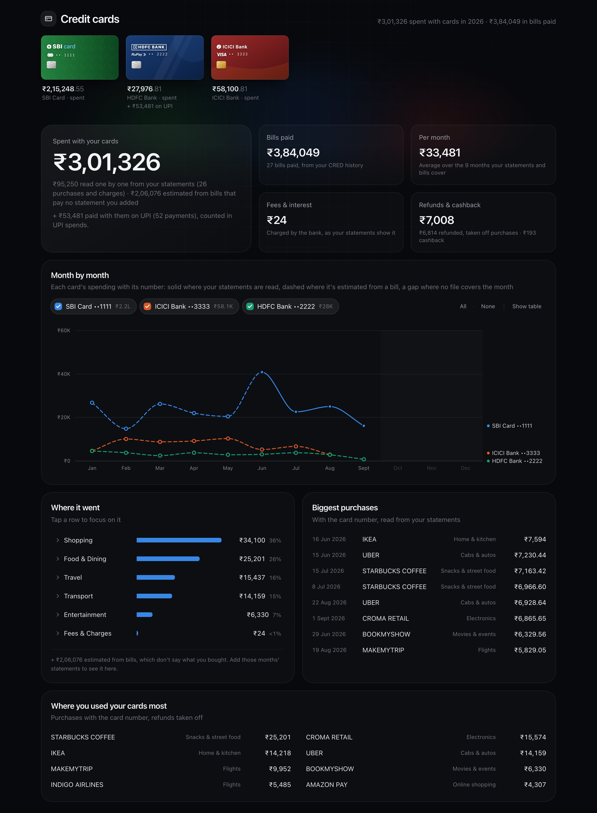
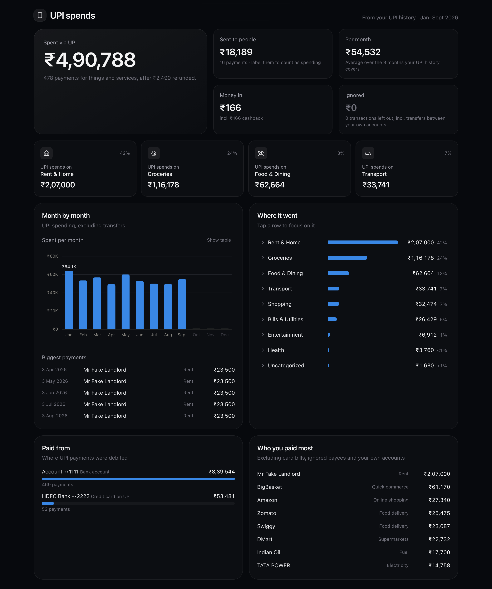
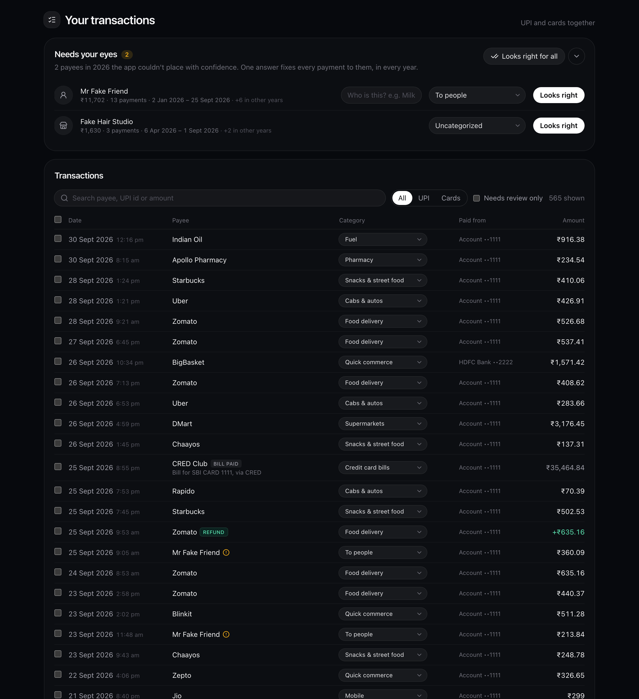
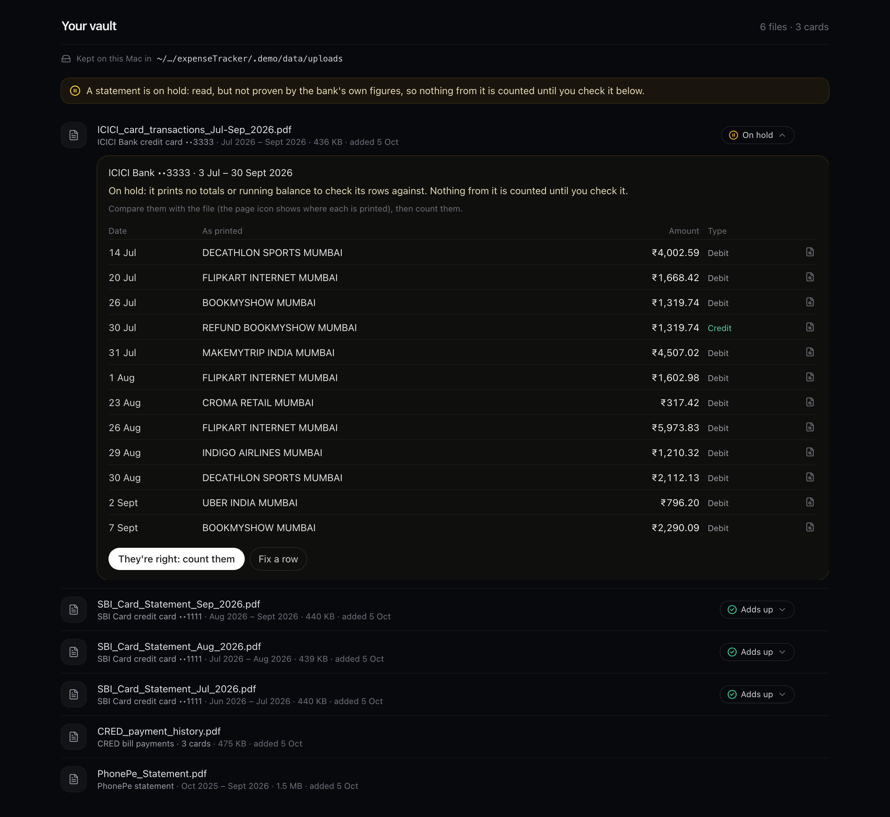
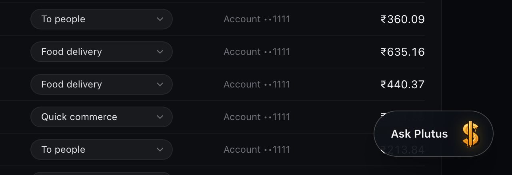

# Plutus

[](https://github.com/iamdebasis/Plutus-Offline-Expense-Tracker/actions/workflows/ci.yml)


[](https://ollama.com)
[](LICENSE)

### The private AI expense tracker for India. Local LLM, zero cloud.

**It reads the statements you already have, answers your questions about them, and nothing ever leaves your Mac.**



<sub>Every figure in these screenshots is made up: they're taken from the built-in demo (`make demo`).</sub>

Spending in India is scattered. UPI payments go through PhonePe and Google Pay, purchases land on two or three credit
cards, and the bills get paid through CRED. Each of these comes as its own PDF or export, in its own layout. Budgeting
apps want your bank login, or they upload your statements to their servers.

Plutus reads the files you can already download (UPI histories, credit card statements, bank exports, payment
screenshots) and turns them into one ledger, with every rupee counted once. It all runs on your machine: no account,
no cloud, no telemetry. It is named for the Greek god of wealth.

## What it does

- **Reads what you have.** It reads PhonePe and CRED statements, Google Pay history (from Google Takeout), any bank's
  credit card statement, the bank's CSV and Excel exports, and UPI payment screenshots. A password-protected PDF asks
  for its password once, and the password is never saved.
- **Counts every rupee once.** One payment often shows up in several files. A RuPay card used on UPI appears in the
  UPI app and on the card statement; a card bill appears in CRED and again as a UPI payment. Plutus matches these
  across files and keeps one copy.
- **Proves its numbers, or holds them.** A card statement is counted only when the bank's own arithmetic accounts for
  every row: previous balance − credits + debits = total due, to the paisa (or a running balance, line by line). One
  that can't be proven is held, counting nothing, until you check it in Your vault, with each row shown on the PDF's
  page.
- **Fills in what statements don't say.** Some months have only a bill, from CRED or the payment the next statement
  shows it received, and no statement of their own. Plutus then estimates that month's card spending from the bill,
  less what's already counted, and places it in the billing cycle the bill paid for.
- **Learns your payees.** Your own answers, rules and a dictionary of public merchants sort payments into
  categories. An optional local AI suggests the rest. Answer once for a payee and every payment to them follows, past
  and future.
- **Shows where it went.** Total spend by category, month-by-month trends, spending per card, UPI spending and a
  searchable ledger. Every chart has a table view.
- **Answers your questions.** Click the gold Plutus button in the corner and ask in your own words: "How much on
  electricity in 2025?", "Top 5 payees last year", "Food delivery during the monsoon", then "and by month?". The answer
  is the dashboard's own number, with how your question was read and the payments behind it. Rules read most questions
  instantly; the optional local AI reads the rest, and it sees only your question, never a transaction. The chat isn't
  saved anywhere.





## Privacy by design

Plutus is built on four rules. This is what enforces each one:

| Rule | How it's enforced |
|---|---|
| **Your data never leaves your Mac.** No file, transaction or name is sent to any server. | The server listens on `127.0.0.1` only. The UI loads no CDN scripts, web fonts or analytics. The app's only outbound connection is to a local Ollama, and `config.py` refuses any AI host that isn't loopback. Every test runs with non-loopback sockets blocked. |
| **No personal data in the code.** | Names, card and account digits, card networks and your choices are all user data, never code. The code ships only what is the same for everyone: categories, public merchants, card designs and parsing rules. A test fails if a module holds a real-looking account number. Tests and the demo use obviously fake data ("Mr Fake Landlord", cards ending in 1111). |
| **Everything about you lives in `data/`.** | One module, `userdata.py`, lists every user file and is the only way into the data folder; a test fails if code goes around it. Original files go to `data/uploads/`, and the tools' temporary copies to `data/run/`. A fresh clone starts empty and gets personal as you add files. **Start over**, at the foot of Your vault, moves all of it to the Trash (you can put it back until the Trash is emptied) and Plutus is a fresh clone again. |
| **Processing and AI stay local.** | PDFs are read with PyMuPDF, scans and screenshots with Apple's on-device OCR (Vision). The optional AI runs in Ollama on your Mac. Plutus starts it on demand and unloads it after 90 seconds idle, and the app works fully without it. Plutus never downloads a model or installs anything: it suggests the model that suits your Mac and shows you the steps. Questions to Ask Plutus are read by rules in the page, or by that local model, which gets the question and the category list, never a transaction; the answer is worked out from your ledger in the page, and the chat isn't saved. |

`.gitignore` and a pre-commit hook (switched on by `make setup`) also keep `data/`, statements, exports and
screenshots out of git, even with `git add -f`. A fork can't publish anyone's finances by accident.

## Try it

You need macOS, Python 3.12+, Node 22.18+ and pnpm. `make check` lists anything missing and how to install it,
and which local AI model suits your Mac, if you want one (optional: click **Local AI** in the app for the same
advice, with copy buttons).

```bash
make setup    # once: installs the Python and web packages, switches on the commit guard
make demo     # a made-up year of spending at http://127.0.0.1:8001 (in .demo/, never data/)
make start    # your own Plutus at http://127.0.0.1:8000, starting empty
make test     # the backend's tests with the network blocked, the dashboard's money checks, TypeScript
```

The [guide](docs/GUIDE.md) covers everything else: each source and how it's read, how the numbers add up, where each
file lives, the local AI, and the tools. [How Plutus reads card statements](docs/READERS.md) is for whoever maintains
the readers: how banks make their statements, how each step reads and proves them, and how to change a reader safely.

## How it works



A file is hashed in the browser before it's uploaded, so a repeat is skipped even under a new name. On the server it
is identified, stored in `data/uploads/`, and read in the background while the dashboard fills in. Transactions land
in plain JSON files, one per year. Categories come from the cheapest, most certain source first. After every import,
the billing step places each card bill in the cycle it paid for.

### Engineering highlights

- **Decoding scrambled PDFs.** CRED's PDFs use fonts with shuffled character codes, so their text layer reads as
  gibberish. Plutus runs on-device OCR on the page and uses it as a key to rebuild each font's character table. It
  then reads the exact text, and accepts the result only if every amount matches between the decoded text and OCR.
- **Any bank's statement, without a parser per bank.** Each statement is read two ways, by its table header and by
  its shape: dates and amounts found however they're printed, glued or marked, and the amount column found by where
  figures line up. Every reading is tried under every meaning the marks could have (is "+" a credit? is a lone "C" the
  rupee sign?), and the statement's own arithmetic picks the one that's proven. Exactly one reading must add up to the
  paisa, or nothing is counted. A year's download is split into its statements, each proven on its own figures.
- **The local AI points, the arithmetic decides.** When the rules can't prove a statement, the local model reads it in
  short chunks with every amount tagged, and answers with tags, never figures, so it can't invent a number. Its
  reading counts only if the statement's figures prove it (or, with nothing to check against, if it matches the rules'
  row for row).
- **Ask Plutus: the AI reads the question, Plutus computes the answer.** A question becomes a query of a fixed shape
  (what kind of answer, categories, payees, cards, period: "FY25", "since April", "last monsoon", "and in 2024?"),
  read by rules in the page or, when they're unsure, by the local model. The answer is computed in the page with the
  dashboard's own functions, and tests hold it equal to the dashboard for every year, with investments counted or left
  out, so the chat can't disagree with a chart. The model's reading is checked too: a payee must be in the question,
  dates must be real, a list of most categories means "everything". On 24 made-up questions, 22 were read right.
- **Never double counting.** A card bill, the purchases it pays for, and the same card used on UPI are three views of
  the same money. Bills are placed in their billing cycle (learned from a single statement, or estimated), netted
  against what's already itemized, and spread over the cycle's days. One rule is tested for every year, every card
  filter, and with investments counted or left out: the UPI section plus the card section always equals Total spend.
- **Deduplication with explicit rules.** Payments match by UTR, then by the app's transaction ID, then by time,
  amount and payee. Explicit rules handle the cases that fool naive matching: two ₹15 teas a minute apart are two
  payments, while PhonePe listing one refund twice is still one.
- **Plain files, written safely.** There's no database, by choice: one JSON file per kind of record, written to a
  temporary file beside it and atomically swapped in, so a crash never leaves half a ledger.
- **Tested against statements nobody wrote by hand.** `backend/tests/statement_gen.py` makes a new random statement
  from every seed: monthly, yearly or any span, in any of the layouts banks use (date formats and separators, column
  orders, reward points and reference columns, forms of ₹, credit marks, wrapped rows, missing headers, EMI schedules
  and worked examples beside the transactions). Every one must be proven exactly or held with the right rows, and
  none counted wrong: on a thousand of them the reader proves every one that prints its figures. `fake_cards.py` and
  `fake_takeout.py` add fixed layouts and a Google Takeout export. No real statement is ever in the repo.

<details>
<summary><b>More screenshots</b>: credit cards, UPI, transactions, your files, the Ask Plutus button</summary>











</details>

## Built with

| | |
|---|---|
| **Backend** | Python 3.12+, FastAPI, Pydantic v2, PyMuPDF, Apple Vision through PyObjC, httpx |
| **Frontend** | React 19, TypeScript, Vite, Tailwind CSS 4, Motion, Lucide, pdf.js |
| **Local AI** (optional) | Ollama with a model that suits your Mac (Plutus suggests one: `qwen3.5:4b` for 16 GB), on `127.0.0.1` only |
| **Storage** | JSON files in `data/`, written atomically |
| **Tests** | pytest with the network blocked, Node's built-in test runner for the dashboard's arithmetic, `tsc` |

```
backend/app/
  ingest/          identify files; text from PDFs, scrambled fonts and OCR
  parsers/         PhonePe, CRED, Google Pay Takeout, card statements, card exports, screenshots
  ledger.py        merge and deduplicate across files
  categorize.py    your answers → rules → merchant dictionary → local AI
  ask.py           Ask Plutus: the local AI reads a question the rules couldn't (never a transaction)
  billing.py       which card, which billing cycle, what each bill paid for
  llm/             Ollama, started on demand and unloaded when idle; which model suits your Mac
  tools/           the demo, plus inspect and redact for sharing a layout without its contents
  userdata.py      the one list of everything kept in data/
backend/tests/     tests, with fake statements generated in code
web/src/
  lib/             the dashboard's arithmetic and Ask Plutus's answers, tested in web/tests/
  components/      dashboard sections, charts, card faces
docs/              the guide, the architecture map, decisions, roadmap, the readers' guide, these screenshots
scripts/           requirements check, dev server, commit guard, screenshots
```

## Working on Plutus

Whether you change Plutus yourself or with an AI agent (Claude Code, Codex, Cursor, Copilot, Gemini CLI, Aider, a
local model), start with [AGENTS.md](AGENTS.md): the four core values, the rules that keep a user's data on their Mac,
and how to work on it. Most agents read it on their own; `CLAUDE.md` and `GEMINI.md` point to it.

- [Architecture](docs/ARCHITECTURE.md): the system map: how a file becomes numbers, every module, route and data
  file, the invariants, and how to add a feature.
- [Decisions](docs/DECISIONS.md): why Plutus is built the way it is.
- [Roadmap](docs/ROADMAP.md): what's been discussed but not built, and the known limits.

A test keeps the map complete: a new module, route or data file fails `make test` until it has its line.

## Status

Plutus is a personal project, in daily use. It runs on macOS only, because it relies on Apple's on-device OCR; the
rest is portable Python and TypeScript. Possible next steps: a reader for Google Pay's PDF statement, other UPI apps'
screenshots without the AI, and an OCR engine for Linux; the [roadmap](docs/ROADMAP.md) has these and more.

## License

MIT, see [LICENSE](LICENSE).

Plutus is not affiliated with any bank, card network or payment app. Their names appear only to identify the files
Plutus reads, and their marks belong to their owners. Plutus is not financial advice.
