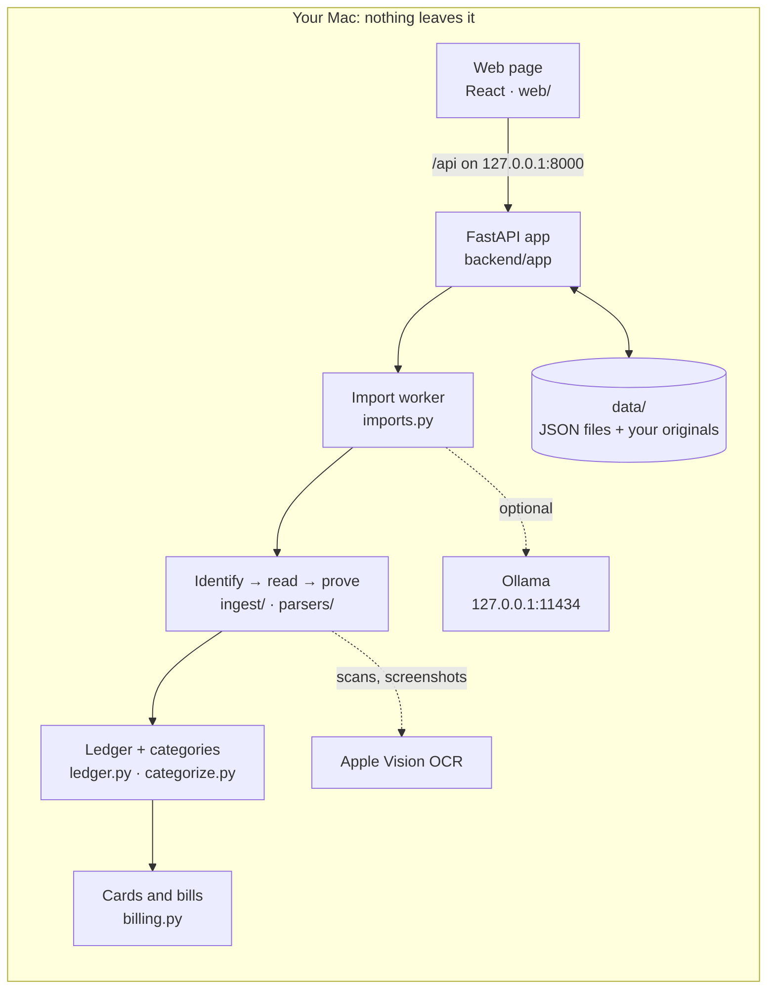
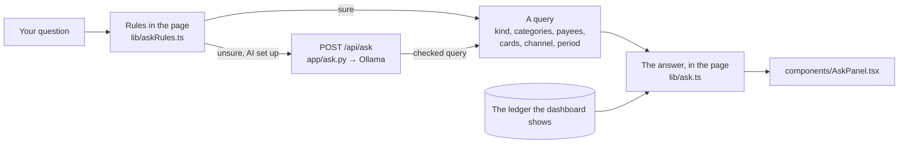

# Plutus architecture

The map of the system: what runs, how a file becomes numbers on the dashboard, where each piece lives, and the rules
that must never break. Written for whoever changes Plutus next, a person or an AI agent. Start with
[AGENTS.md](../AGENTS.md) for the rules of working on it; [DECISIONS.md](DECISIONS.md) says *why* things are the way
they are; [READERS.md](READERS.md) goes deep on card statements; [GUIDE.md](GUIDE.md) is the user's manual.

`tests/test_docs.py` (in `backend/`) fails if a module, an API route or a data file is missing from this map, so keep
it current: a change that adds one adds its line here.

## The system at a glance

Plutus is a local web app: a Python server on `127.0.0.1` and a React page it serves. Everything (your files, the
reading, the categorizing, the optional AI) happens on your Mac. The only other process it talks to is a local
Ollama, also on `127.0.0.1`.

| Process | Where | Port |
|---|---|---|
| Plutus server (FastAPI + uvicorn), serving the built page from `web/dist` | `backend/app/main.py` | 8000 (`ET_PORT`) |
| Vite dev server with hot reload, proxying `/api` to 8000 (`make dev` only) | `web/` | 5173 |
| The demo, on made-up data in `.demo/` (`make demo`) | `app/tools/demo.py` | 8001 |
| Ollama, optional; started by Plutus when a job needs it, or the user's own Ollama app | `app/llm/ollama.py` | 11434 (`ET_OLLAMA_HOST`) |

## How a file becomes numbers

1. **Received** (`POST /api/uploads`, `app/routes/uploads.py`). The bytes stream to `data/run/` while being hashed; a
   password-protected PDF is unlocked; a file already in the vault (same hash) is reported, not stored twice. The
   original goes to `data/uploads/<kind>/` (`app/storage.py`) and gets a record in `data/uploads.json`
   (`app/vault.py`). A Google Takeout folder is packed into a zip first (`POST /api/uploads/folder`).
2. **Identified** (`app/ingest/detect.py`): which kind of file it is (card statement, card export, CRED history,
   PhonePe statement, Google Pay Takeout, screenshot), cheaply, never with the AI. Cards named in it are recorded
   (`data/instruments.json`).
3. **Queued** for the import worker (`app/imports.py`), one file at a time. The page follows it through
   `GET /api/uploads` (every second while something is being read).
4. **Read** by the parser for its kind (`app/parsers/`). Lines come from the PDF's text layer, or from Apple's OCR when
   the text is missing or scrambled (`app/ingest/textlines.py`, `app/ingest/ocr.py`). Card statements are read two
   ways and kept only when the statement's own arithmetic proves the reading; otherwise they're **held**
   (see [Card statements](#card-statements)).
5. **Added to the ledger** (`app/ledger.py`): deduplicated against what's already there (the same payment seen in two
   files is one payment: `_keys` / `_can_be_same`), under the ledger's lock.
6. **Categorized** (`app/categorize.py`): your answers first, then rules, the merchant dictionary, earlier AI answers,
   keywords; payee names nothing recognises go to the local AI if one is set up, else to "Needs your eyes".
7. **Placed**: which card each app payment used and which billing cycle each card bill paid for (`app/billing.py`,
   run by `ledger.place_cards`, and again after every edit of the ledger). A bill is an app's record (CRED) or a
   statement's own payment row that no app recorded.
8. **Shown**: the page reloads the ledger (`GET /api/transactions`, `/api/card-payments`, `/api/card-statements`) and
   computes every total in the browser (`web/src/lib/`), from the same rows the tests check.

At startup (`app/main.py` lifespan), Plutus re-identifies files read by an older detector, re-reads files whose reader
improved (`PARSER_VERSIONS` in `app/imports.py`), re-applies changed rules, folds duplicates, and picks the local
model. Files are never re-uploaded: their originals are in `data/uploads/`.

## Backend modules

Python 3.12+, FastAPI, Pydantic v2, PyMuPDF, Apple Vision through PyObjC, httpx. Paths are relative to `backend/`.

**The app**

| Module | What it does |
|---|---|
| `app/main.py` | The FastAPI app: startup housekeeping, the import worker, security middleware (loopback hosts only, writes only from this machine's pages, CSP), the API routers and the built page |
| `app/config.py` | Settings from the environment: `ET_DATA_DIR`, `ET_PORT`, `ET_OLLAMA_HOST` (refused unless loopback), `ET_OLLAMA_MODEL`, `ET_OLLAMA_IDLE_SECONDS` |
| `app/models.py` | Pydantic models for every record (camelCase on disk and over the API): `UploadRecord`, `Transaction`, `CardPayment`, `CardStatement`, `Instrument`, `Payee`, `OwnAccount` |
| `app/logs.py` | One readable terminal line per event, tagged by area (`startup`, `import`, `parse`, `category`, `llm`, …) |
| `app/jsonstore.py` | JSON files written atomically (temp file, fsync, rename), one lock per file |
| `app/userdata.py` | **The** list of everything kept about you in the data folder, and the only way in: `path()` refuses an unlisted name |

**Your data**

| Module | What it does |
|---|---|
| `app/storage.py` | Where originals are kept (always `data/uploads/`), the folder for files being received, a warning when the project sits in a cloud-synced folder |
| `app/vault.py` | Uploaded files and the cards found in them (`data/uploads.json`, `data/instruments.json`) |
| `app/ledger.py` | Every transaction (`data/ledger/<year>.json`) and card bill payment; deduplication; the ledger's lock (`editing()`, `@exclusive`) so an import and your edits never overwrite each other, and the bills placed again after an edit |
| `app/statements.py` | Your card statements (`data/card_statements.json`): period, the bank's figures, proven or held |
| `app/payees.py` | Your payee table (`data/payees.json`): people you pay and what for |
| `app/accounts.py` | Your own bank accounts, last four digits only (`data/accounts.json`): transfers between them count nowhere |
| `app/preferences.py` | Your settings (`data/settings.json`): investments counted or left out, the local model you picked, the AI hint answered |
| `app/reset.py` | Start over: moves everything `userdata.py` lists to the macOS Trash (recoverable), refused while reading |

**Reading files**

| Module | What it does |
|---|---|
| `app/imports.py` | The background worker: read → ledger → categorize → local AI; `PARSER_VERSIONS` and `DETECTOR_VERSION` (bump them when a reader or the detector improves) |
| `app/ingest/detect.py` | What a file is, from its words or its shape (a card plus a table of dated amounts), and which cards it names |
| `app/ingest/issuers.py` | Indian card issuers and how they appear in statement text |
| `app/ingest/textlines.py` | Positioned lines per page: text layer, else decoded scrambled fonts, else OCR |
| `app/ingest/ocr.py` | Apple Vision OCR, on the Mac |
| `app/parsers/card_statement.py` | Card statements: lines, the summary's figures (`read_summary`), rows by the table header (`read_rows`), what each row is (`classify`: purchase, refund, bill payment, EMI…) |
| `app/parsers/shape_reader.py` | Rows found by shape, whatever the wording: tokens, columns where amounts line up, tables aligned to each other |
| `app/parsers/statement_reader.py` | Every reading, every meaning of the marks, and `decide()`: the statement's arithmetic picks the one proven reading, or holds it; `segments()` splits a year's file into statements |
| `app/parsers/statement_ai.py` | The local AI's reading of a held statement: it points at tagged amounts, never writes one; counted only if proven |
| `app/parsers/card_export.py` | A bank's export of a card's transactions (CSV, Excel, HTML-as-.xls) |
| `app/parsers/cred.py` | CRED's payment history: one block per card bill paid |
| `app/parsers/phonepe.py` | PhonePe's statement PDF |
| `app/parsers/gpay_takeout.py` | Google Pay history from a Google Takeout export |
| `app/parsers/screenshot.py` | One UPI receipt screenshot: OCR and rules, else the local vision model (its amount must appear in the OCR text) |

**Sorting and money**

| Module | What it does |
|---|---|
| `app/categorize.py` | The category of every payment, cheapest and most certain source first (the order is at the top of the file); refunds linked to their payments; the local AI for unknown names |
| `app/billing.py` | Which card an app's "XXXX99" is; the bills a statement's own payment rows record that no app did (`statement_bills`); each card bill's cycle; whether a statement covers it; the estimate for a cycle no statement covers |
| `app/seed/` | The same for everyone: `categories.json` (the category tree), `merchants.json` (public merchants), `bank_categories.json` (banks' own labels) |

**The local AI** (optional)

| Module | What it does |
|---|---|
| `app/llm/ollama.py` | `OllamaManager`: starts `ollama serve` when a job needs it, unloads the model and stops the server after 90 s idle, leaves a user's own Ollama running; one JSON-constrained chat call |
| `app/llm/advice.py` | Which model suits this Mac (memory, chip, macOS, Ollama's version) and the steps to get it; standard library only, so `make check` runs it; never downloads |
| `app/llm/setup.py` | The Local AI panel's data and the model Plutus uses: `ET_OLLAMA_MODEL`, else your pick, else the best downloaded for this Mac |
| `app/llm/__main__.py` | `make llm-check`: a live round trip with the model Plutus uses |
| `app/ask.py` | Ask Plutus: a question the page's rules couldn't read, turned into a query of a fixed shape by the local AI and checked here; the model sees the question, the category tree and today's date, never a transaction |

**The API** (all under `/api`, JSON in camelCase)

| Module | Routes |
|---|---|
| `app/routes/uploads.py` | `GET /api/uploads`, `POST /api/uploads`, `POST /api/uploads/folder`, `GET /api/uploads/{upload_id}/file`, `POST /api/uploads/{upload_id}/reimport`, `DELETE /api/uploads/{upload_id}`, `GET /api/instruments`, `PUT /api/instruments/{instrument_id}` |
| `app/routes/ledger.py` | `GET /api/transactions`, `GET /api/card-payments`, `GET /api/card-statements`, `PUT /api/card-statements/{statement_id}/held`, `POST /api/card-statements/{statement_id}/confirm`, `POST /api/categorize`, `POST /api/categorize/shop`, `POST /api/categorize/payments`, `POST /api/categorize/payments/undo`, `POST /api/categorize/bulk`, `POST /api/recategorize`, `GET /api/accounts`, `POST /api/accounts`, `DELETE /api/accounts/{last4}` |
| `app/routes/storage.py` | `GET /api/storage`, `POST /api/storage/reveal` |
| `app/routes/system.py` | `GET /api/status`, `GET /api/preferences`, `PUT /api/preferences`, `GET /api/card-art`, `GET /api/card-art/{name}`, `GET /api/reset`, `POST /api/reset`, `GET /api/llm/status`, `GET /api/llm/setup`, `PUT /api/llm/model`, `POST /api/llm/hint-seen`, `POST /api/ask`, `GET /api/categories`, `GET /api/payees`, `PUT /api/payees/{payee_id}`, `DELETE /api/payees/{payee_id}` |

Errors are `{"detail": {"code": "...", "message": "..."}}` with a message written for the person reading it.

**Tools** (`make inspect`, `make redact`, `make inspect-takeout`, `make demo`)

| Module | What it does |
|---|---|
| `app/tools/inspect.py` | What the detector and the statement reader see in a PDF, masked (letters as X, digits as 9) |
| `app/tools/inspect_takeout.py` | A Google Pay export's structure, masked |
| `app/tools/redact.py` | A layout-preserving anonymised copy of a statement, to share its layout |
| `app/tools/demo.py` | A year of made-up spending read as if it were yours, in `.demo/` (never `data/`), AI off |

## Card statements

No parser per bank. Each statement is read by its table header and by its shape, under every meaning its marks could
have ("+" a credit or not, a lone "C" the rupee sign or a credit). The statement's own arithmetic decides:

- previous balance − credits + debits = total due, to the paisa (within 50 paise when the total is a whole rupee); or
- with no balances printed, its printed totals of debits and of credits; for a year-end summary, over the cycles of
  the statements it sums up; or
- a running balance every row moves by exactly its amount.

Exactly one reading passing is **proven**; none, or two different ones, is **on hold**: nothing from it counts until
you confirm or correct it in Your vault (`PUT .../held`, `POST .../confirm`), each row shown on the PDF's page
(`components/PagePeek.tsx`). The local AI may try a held statement; its reading counts only if proven (or **agreed**:
nothing to check against, but it matches the rules' reading row for row). [READERS.md](READERS.md) has the banks'
layouts, the diagnosis table and the procedure for changing a reader; `make measure` runs 1000 random fake
statements through it all.

## Categories and money

- **Order** (top of `app/categorize.py`): your answer for that very row (`data/row_answers.json`) → kind (refunds,
  cashback, a statement's card payment) → your payee table → your corrections by name → card statement rules (fees,
  loans) → own accounts → card bill payments by name → merchant dictionary → earlier AI answers and the bank's own
  category → keywords → "looks like a person" → the local AI.
- **Kinds**: spend, refund, cashback, income, transfer, bill_payment. **Buckets** on the page (`bucketOf` in
  `web/src/lib/ledger.ts`): spent, people, card bill, money in, cashback, ignored.
- **Never double counted**: a card bill pays for a cycle of purchases. When a statement (or an export spanning the
  cycle) lists that cycle, the bill adds nothing; otherwise the bill stands for the cycle's card purchases, less what's
  already counted (`estimate`), spread over the cycle's days. The UPI section + the card section = Total spend, for
  every year and card filter (`web/src/lib/totals.ts`, tested).
- **Card bill payments**, either side (the statement's "PAYMENT RECEIVED", the UPI or bank payment that paid it), are
  neither spending nor money in. A statement's bill payment is never moved by a name-based answer; changing one row
  asks first (`components/dash/TransactionsTable.tsx`).
- **Refunds** come off the payment they refund (`refundOf`); an EMI instalment is spending in the bill that charges it;
  an EMI conversion credit nets against its purchase; a loan's instalments count nowhere.
- **Scope**: investments can be left out (`data/settings.json`); left-out payments still come off card bills.

## The local AI

Optional; Plutus works fully without it. Four fallback jobs: payees nothing recognises (names and a typical amount
only), held or unreadable statements (tagged lines in 20-line parts; it answers with ids), screenshots in unknown
layouts (vision), and questions to Ask Plutus the rules couldn't read (the question only; it answers with a query). Every call is one non-streaming chat with a JSON schema, thinking off, temperature 0, to
`127.0.0.1` only (httpx with `trust_env=False`: no proxy can route it elsewhere).

- **Lifecycle** (`app/llm/ollama.py`): the first job starts `ollama serve` (unless one is running), the model is
  unloaded and a server Plutus started is stopped after 90 s idle; the page's pill shows the model's state.
- **Which model** (`app/llm/setup.py`, `app/llm/advice.py`): `ET_OLLAMA_MODEL` → your pick in the Local AI panel →
  the most capable downloaded model that suits this Mac → none ("not set up"). The suggestion goes by memory:
  8–15 GB `qwen3.5:2b`, 16–23 GB `qwen3.5:4b`, 24 GB+ `qwen3.5:9b`; none on Intel or under 8 GB.
- **Never downloads or installs**: the panel shows the steps (install Ollama, `ollama pull …`); Ollama must be
  0.32.7+ (JSON with thinking off).

## Ask Plutus

Questions about your spending, in a panel opened from the orb in the dashboard's corner. **The AI reads the question;
Plutus computes the answer.** No model is trained on, or shown, your transactions.

- **Rules first** (`lib/askRules.ts`): periods (years, India's financial years, months, "last 3 months", "since…",
  India's seasons by `SEASONS` in `lib/ask.ts`, the local AI told the same months),
  categories by name or a common word ("petrol", "food orders"), payees by the words of their names, cards by their
  last four digits or bank, and follow-ups ("and in 2024?"). A word they don't know makes them unsure.
- **The local AI only when unsure** (`app/ask.py`, `POST /api/ask`): it gets the question, today's date, the category
  tree (the same for everyone) and, for a follow-up, the last query; it answers in a JSON schema, and the server keeps
  only known categories, real dates and sane limits. Without the AI the rules answer what they understood, marked
  unsure, or say they couldn't read it.
- **Plutus computes** (`lib/ask.ts`): from the same scoped ledger, with the dashboard's own counting (`bucketOf`,
  refunds dated on their payment's day, card bills' estimates over their cycles), so the total for a year equals Total
  spend, a category's equals its bar, a payee's equals its row. `web/tests/ask.test.ts` checks that for every year,
  with investments counted and left out.
- **Every answer shows how it was read** (chips you can change or remove), what it leaves out (card spending known
  only from bills has no category or payee; a held statement; where your files start) and "Show these payments": the
  exact rows, in the transactions list.
- History lives in the page only: nothing about a question is stored, and the server never logs one.

## The data folder

`data/` in the project (or `ET_DATA_DIR`), gitignored, created as you use Plutus; `app/userdata.py` is the
authoritative list and the only way in.

| Path | What |
|---|---|
| `data/uploads.json` | One record per file you added: hash, what was detected, how reading it went |
| `data/uploads/` | Your original files, sorted by kind |
| `data/ledger/` | Every transaction, one file per calendar year |
| `data/card_payments.json` | Card bill payments (from CRED and similar, or a statement's own payment row that no app recorded) and the cycle each paid for |
| `data/instruments.json` | Your cards as your files name them: bank, product, last four digits, network |
| `data/card_networks.json` | The network you set for a card |
| `data/card_statements.json` | Your card statements: period, the bank's figures, proven or held |
| `data/accounts.json` | Your own bank accounts, last four digits |
| `data/payees.json` | Your payee table |
| `data/merchant_memory.json` | Your corrections by payee name, and the local AI's earlier answers |
| `data/row_answers.json` | The category you set for one payment, kept with its row |
| `data/settings.json` | Your settings |
| `data/state.json` | Housekeeping: which rules the ledger was last sorted with |
| `data/statement_ai.json` | The local AI's answers about statements, so a file read again doesn't ask again |
| `data/run/` | Files being received; the local AI's process id and log |
| `data/redacted/` | Anonymised copies made by `make redact` |
| `data/card-art/` | Pictures of your cards you added, shown on their card faces |

A `Transaction` is one payment: when, amount (always positive) and direction, kind, channel (upi or card), payee,
category and how it was decided, `sources` (the file and page it came from), `refs` (UTR, transaction id, the
statement row), `refundOf`, `settles`, `card`. A `CardStatement` carries its period, the bank's figures, its status
(proven, agreed, confirmed, on hold) and, when held, its rows waiting in `held`.

## The web page

React 19, TypeScript, Vite, Tailwind CSS 4, Motion, Lucide, pdf.js; built into `web/dist` and served by the backend.
No CDN, fonts or analytics: everything is bundled. Paths are relative to `web/src/`.

**Shell**: `main.tsx` (mounts the app), `App.tsx` (the Welcome page until there's data, then the Dashboard; adding
files and following their reading live here), `api.ts` (every call to `/api`), `types.ts` (the records, as the API
sends them).

**Pages**: `pages/Welcome.tsx` (first run: what Plutus reads, drop files, the vault), `pages/Dashboard.tsx` (the
year tabs, every section, and Ask Plutus), `pages/CardGallery.tsx` (every card design, at `/#card-gallery`).

**Components**

| File | What it is |
|---|---|
| `components/Header.tsx` | Logo, "On this Mac only", the Local AI pill (opens the panel) and its one-time hint |
| `components/AiPanel.tsx` | The Local AI panel: this Mac, Ollama, downloaded models, the suggestion and the steps |
| `components/FileIntake.tsx` | Adding files: the picker, the folder picker, sending them |
| `components/DropLayer.tsx` | Drop files anywhere on the page |
| `components/FileSheet.tsx` | The sheet listing the files picked, before and while they're sent |
| `components/FileRow.tsx` | One file in that sheet: kind, password, status |
| `components/ImportActivity.tsx` | "Reading 2 of 5", then a summary; each file's progress |
| `components/SourceTiles.tsx` | The kinds of file Plutus reads, as tiles on the Welcome page |
| `components/GooglePayGuide.tsx` | How to get a Google Pay history from Google Takeout |
| `components/Vault.tsx` | Your vault: files, cards, each statement's check, held statements to review |
| `components/PagePeek.tsx` | A page of a file you added, drawn here, with the row in question marked |
| `components/StoragePanel.tsx` | Where your files are kept, with a cloud-sync warning |
| `components/AskPanel.tsx` | Ask Plutus: the chat, each answer with its figure, lines, how it was read (chips to change) and the payments behind it |
| `components/AskOrb.tsx` | The way into Ask Plutus: the gold mark in a glass orb, bottom-right whatever the scroll; opens into "Ask Plutus" on hover, its drips run while a question is read |
| `components/StartOver.tsx` | Start over: what goes to the Trash, typed confirmation, then a fresh start |
| `components/Toasts.tsx` | Short notices |
| `components/Backdrop.tsx` | The background grid and glows |
| `components/CardFace.tsx` | A card drawn: its bank's design or your picture of it |
| `components/cards/skins.tsx` | Card designs, one per bank (never per card product) |
| `components/cards/parts.tsx` | Chip, network marks and wordmarks for card faces |
| `components/brand/PlutusLogo.tsx` | The Plutus mark |
| `components/dash/Section.tsx` | A dashboard section's title row |
| `components/dash/TotalSpend.tsx` | Total spend: UPI + cards, with how card spending was counted |
| `components/dash/MonthlyChart.tsx` | One series of monthly columns |
| `components/dash/MonthlyTrends.tsx` | Month by month, per category |
| `components/dash/Trends.tsx` | The shared month-by-month lines (categories, cards), estimated months dashed |
| `components/dash/SpendDonut.tsx` | Spending by category, as a ring |
| `components/dash/CategoryBars.tsx` | Spending by category, as bars |
| `components/dash/CardSpending.tsx` | Credit cards: purchases with each card's number |
| `components/dash/InvestmentsSwitch.tsx` | Investments counted or left out |
| `components/dash/ReviewQueue.tsx` | "Needs your eyes": payees to name, answered in bulk |
| `components/dash/TransactionsTable.tsx` | Every payment: search, filters, category per row or ticked several, tags, the card bill guard |
| `components/dash/CategorySelect.tsx` | The category picker |

**Logic** (`lib/`, tested in `web/tests/` with Node's test runner on fake ledgers)

| File | What it does |
|---|---|
| `lib/ledger.ts` | The ledger as the page uses it: buckets, card bills, row tags, how each payment was paid (`howPaid`: the list's "Paid with"), one payment one row (a bill's sides folded: `billSides`, `oneRowPerPayment`, `billNote`), the view for a period |
| `lib/totals.ts` | Total spend for a period, cards and UPI together, counted once; colours fixed per category |
| `lib/cards.ts` | Spending per card (card-number purchases only); colours per card |
| `lib/periods.ts` | Calendar years, months, labels |
| `lib/scope.ts` | Investments left out or counted |
| `lib/ask.ts` | Ask Plutus's answers: a query worked out from the ledger with the dashboard's own counting; questions to start with |
| `lib/askRules.ts` | Ask Plutus's rules: a question read into a query in the page, and whether they're sure of it |
| `lib/selection.ts` | Ticking payments; what the ticked ones add up to |
| `lib/useSelection.ts` | The files picked to add, before they're sent |
| `lib/useImportActivity.ts` | What the server is reading, polled for the whole page |
| `lib/aiHint.ts` | When the one-time AI hint shows, and what it says |
| `lib/aiPanel.ts` | The Local AI panel's open state, shared |
| `lib/cardArt.ts` | Matching your card pictures to your cards |
| `lib/categoryIcons.ts` | An icon per category |
| `lib/format.ts` | Plurals, paths, spans, file sizes |
| `lib/money.ts` | Rupees, Indian grouping |
| `lib/scale.ts` | Axis ticks |
| `lib/issuers.ts` | A card's id, the same as the backend's |
| `lib/pdfPeek.ts` | A PDF's first page and page count, drawn locally |
| `lib/sources.ts` | The kinds of file Plutus reads, and which files of a Takeout folder to send |
| `lib/storage.ts` | Where files are kept, shared by the components that show it |

**Design**: a neutral dark UI (zinc greys, glass panels, no teal); green only for money coming in; amber for "look at
this", rose for danger; the transactions list's "Paid with" chips tinted by kind (a card in the palette's blue, UPI in
its violet). Charts follow the validated palette in `web/src/index.css` (`--color-series-*`): thin marks,
one filter row, a table view for every chart, and colours that follow the entity (a category's or card's colour is
fixed from all-time totals, never by rank in a period). Every state has a calm, worded version: empty, busy, error,
done.

## Privacy, enforced

- The server listens on `127.0.0.1` only; `TrustedHostMiddleware` refuses other host names (DNS rebinding); writes to
  `/api` are refused unless they come from this machine's own pages; a strict CSP; no Swagger page (it loads a CDN).
- The AI host is validated to be loopback (`app/config.py`); the AI client ignores proxy settings.
- Every backend test runs with non-loopback sockets blocked, the real AI blocked, this Mac's Ollama out of reach, and
  a Trash of its own (`backend/tests/conftest.py`).
- `.gitignore` and `scripts/git-hooks/pre-commit` (switched on by `make setup`) keep `data/`, statements, exports and
  screenshots out of git; `tests/test_own_accounts.py` fails if code reaches the data folder directly or holds a
  real-looking account number.

## Invariants: must never break

1. Nothing about a user leaves the Mac: no network calls except to `127.0.0.1`.
2. Nothing about a particular person in the code, tests or docs: fake data only.
3. Everything about a user is in the data folder, listed in `app/userdata.py`.
4. Every figure stored is one a file prints; nothing (the AI included) creates or changes a number.
5. A card statement counts only when proven, agreed or confirmed by you; held rows count nowhere.
6. Nothing is counted twice: UPI section + card section = Total spend, for every period and filter.
7. Your answers survive a re-read, an import running meanwhile, and a file deleted and added again.
8. Plutus works fully without Ollama, and never downloads or installs anything.
9. Removing your data is recoverable (the Trash) and never runs while a file is being read.

## Testing and tools

| Command | What it does |
|---|---|
| `make check` | What this Mac needs and how to get it; which local model suits it |
| `make setup` | Once: the Python and web packages, the commit guard |
| `make start` | Build the page and serve Plutus at http://127.0.0.1:8000 |
| `make dev` | Backend on 8000 and Vite on 5173 with hot reload |
| `make test` | Backend tests (network blocked), the page's money checks, the TypeScript check |
| `make measure` | 1000 random fake statements through identify → read → decide: none wrong, none unread |
| `make demo` / `make screenshots` | The made-up year on 8001 / the README's pictures from it |
| `make inspect FILE=…` / `make redact FILE=…` / `make inspect-takeout FILE=…` | Masked structure of a file / an anonymised copy / a Takeout's structure |
| `make llm-check` | A live round trip with the local model |

Fakes: `tests/statement_gen.py` (random statement layouts), `tests/fake_cards.py` (banks' layouts as they make them),
`tests/fake_takeout.py` (a Google Takeout export), `web/tests/fixtures.ts` (fake ledgers). CI
(`.github/workflows/ci.yml`) runs the backend tests, the page's tests, the type check and a build on a macOS runner.

End-to-end checks run against a scratch server: `ET_DATA_DIR` set to a scratch folder (never `data/`), its own port,
`ET_OLLAMA_HOST=127.0.0.1:9` unless the AI is under test, and a scratch Trash for Start over.

## Adding a feature

1. Check it against the core values ([AGENTS.md](../AGENTS.md)): nothing leaves the Mac, nothing personal in code,
   user data only in `data/` (a new file is listed in `app/userdata.py`), local only.
2. Find its place in this map; follow the module's existing patterns and wording.
3. Write the test first, with fake data; see it fail; make it pass; switch the fix off and see the test fail again.
4. Money: keep the totals invariant; if a reader or the detector changes, bump `PARSER_VERSIONS` /
   `DETECTOR_VERSION` and run `make measure`.
5. UI: every state worded (empty, busy, error, done), the existing look, checked in a real browser on a scratch server.
6. Update this map (the docs test checks it), [DECISIONS.md](DECISIONS.md) if you decided something,
   [GUIDE.md](GUIDE.md) for what the user sees, [ROADMAP.md](ROADMAP.md) for what's left.
7. `make test`; sweep the diff for anything personal before committing.

## Glossary

| Term | Meaning |
|---|---|
| **Proven** | A statement whose rows the bank's own figures account for exactly |
| **On hold / held** | Read but not proven: nothing from it counts until you confirm or correct it |
| **Agreed** | Nothing on it to check against, but the rules and the local AI read the same rows |
| **Confirmed** | A held statement you checked and accepted |
| **Card bill** | A payment to your own credit card, either side of it; never spending, never money in |
| **Cycle** | The span of purchases one card bill pays for, from the card's statements or guessed |
| **Covered** | A cycle a statement or export lists whole: its purchases are counted one by one |
| **Estimate** | For a cycle nothing covers: the bill, less what's already counted in it |
| **Instrument** | A card, as your files name it |
| **Row answer** | A category you set for one payment, kept with its row |
| **Needs your eyes** | Payees nothing recognised, waiting for your answer |
| **Query** | What a question to Ask Plutus asks, in a fixed shape (what kind of answer, categories, payees, cards, channel, period); Plutus works out its answer |
| **Start over** | Everything in the data folder to the Trash; Plutus as a fresh clone |
